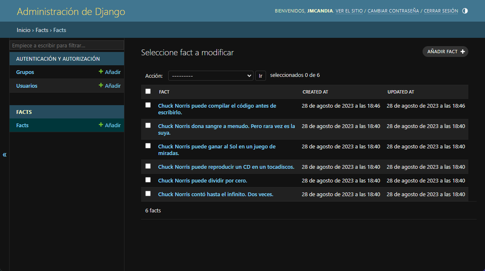

# Unidad 2: Framework Backend (Parte 1)

Construye aplicaciones web usando un framework del lado del servidor según requerimiento.

## Paso a paso

En la unidad anterior, creamos un proyecto Django y una aplicación. El proyecto resultante quedó con la siguiente estructura:

```plaintext
chuck_norris/
├── chuck_norris/
│ ├── asgi.py
│ ├── settings.py
│ ├── urls.py
│ ├── wsgi.py
│ └── __init__.py
├── facts/
│ ├── migrations/
│ │ └── __init__.py
│ ├── admin.py
│ ├── apps.py
│ ├── models.py
│ ├── tests.py
│ ├── urls.py
│ ├── views.py
│ └── __init__.py
└── manage.py
```

En primer lugar, vamos a instalaremos la lbrería `django-bootstrap-v5`, para darle la capacidad a Django de incorporar el framework Bootstrap. Para instalar esta librería, ejecutaremos el siguiente comando:

```bash
pip install django-bootstrap-v5
```

Y agregaremos la librería a la lista de aplicaciones instaladas en el archivo `settings.py`, en la sección `INSTALLED_APPS` de la siguiente forma:

```python
INSTALLED_APPS = [
    ...
    'facts', # <- Esta es la aplicación creada
    'bootstrap5', # <- Esta es la librería instalada
    ...
]
```

Ahora, vamos a crear un modelo para almacenar los datos de los hechos de Chuck Norris. Para ello, modificaremos el archivo `models.py` de la aplicación `facts`, en donde definiremos el modelo `Fact`:

```python
from django.db import models

class Fact(models.Model):
    fact = models.CharField(max_length=255)
    created_at = models.DateTimeField(auto_now_add=True)
    updated_at = models.DateTimeField(auto_now=True)

    def __str__(self):
        return self.fact
```

La explicación del código anterior es la siguiente:

- Importamos el módulo `models` de Django. Esto nos permite generar clases que representan tablas en la base de datos.
- La clase `Fact` hereda de `models.Model`. Esto indica que la clase `Fact` representa una tabla en la base de datos.
- El atributo `fact` es de tipo `models.CharField`. Esto indica que el campo `fact` es de tipo texto, y el parámetro `max_length` indica la cantidad máxima de caracteres que puede almacenar el campo.
- El atributo `created_at` es de tipo `models.DateTimeField`. Esto indica que el campo `created_at` es de tipo fecha y hora, y el parámetro `auto_now_add` indica que el campo se debe llenar automáticamente con la fecha y hora de creación del registro.
- El atributo `updated_at` es de tipo `models.DateTimeField`. Esto indica que el campo `updated_at` es de tipo fecha y hora, y el parámetro `auto_now` indica que el campo se debe llenar automáticamente con la fecha y hora de actualización del registro.
- El método `__str__` retorna el valor del atributo `fact` cuando se imprime el objeto.

Ahora, debemos crear la migración para que Django cree la tabla en la base de datos. Para ello, ejecutaremos el siguiente comando:

```bash
python manage.py makemigrations facts
```

> **Nota:** Las migraciones son archivos que contienen las instrucciones para crear o modificar tablas en la base de datos.

Con la migración creada, debemos ejecutarla para que se cree la tabla en la base de datos. Con ese fin, ejecutaremos el siguiente comando:

```bash
python manage.py migrate
```

A continuación, vamos a usar las capacidades de las migraciones para crear los registros iniciales en la base de datos. Para aquello, modificaremos el archivo `models.py` de la aplicación `facts`:

```bash
python manage.py makemigrations facts --empty --name initial_data
```

El código anterior crea un archivo de migración vacío llamado `initial_data.py`, en el que agregaremos el código para crear los registros iniciales en la base de datos:

```python
from django.db import migrations

def create_facts(apps, schema_editor):
    Fact = apps.get_model('facts', 'Fact')
    Fact.objects.create(
        fact='Chuck Norris contó hasta el infinito. Dos veces.')
    Fact.objects.create(
        fact="Chuck Norris puede dividir por cero.")
    Fact.objects.create(
        fact="Chuck Norris puede reproducir un CD en un tocadiscos.")
    Fact.objects.create(
        fact="Chuck Norris puede ganar al Sol en un juego de miradas.")
    Fact.objects.create(
        fact="Chuck Norris dona sangre a menudo. Pero rara vez es la suya.")

class Migration(migrations.Migration):
        dependencies = [
            ('facts', '0001_initial'),
        ]
        operations = [
            migrations.RunPython(create_facts),
        ]
```

En el código anterior, definimos una función llamada `create_facts` que crea los registros iniciales en la base de datos. Luego, en la clase `Migration`, definimos una operación que ejecuta la función `create_facts`.

Ahora, debemos ejecutar la migración de datos usando el comando:

```bash
python manage.py migrate
```

Con esto, ya tenemos creada la tabla en la base de datos y los registros iniciales.

Ahora, debemos crear el formulario para crear nuevos hechos de Chuck Norris. Para ello, crearemos el archivo `forms.py`, dentro de la aplicación `facts`:

```python
from django import forms
from .models import Fact

class FactForm(forms.ModelForm):
    class Meta:
        model = Fact
        fields = ['fact']
        widgets = {
            'fact': forms.Textarea(attrs={
                'placeholder': 'Ingrese su hecho favorito'
            })
        }
        labels = {
            'fact': 'Hecho'
        }
```

En el código anterior, definimos una clase llamada `FactForm` que hereda de `forms.ModelForm`. Luego, definimos una clase `Meta` que define el modelo y los campos del formulario. Además, definimos un widget para el campo `fact` que define que el campo es un `Textarea`. Por último, definimos una etiqueta para el campo `fact` que define el texto que se mostrará en el formulario.

En este punto, vamos a modificar el archivo `views.py` de la aplicación `facts`, para que muestre los hechos de Chuck Norris, usando el modelo `Fact`. También agregaremos la nueva función `create_view` que se encargará de crear nuevas entradas en la base de datos:

```python
import random
from django.shortcuts import redirect, render
from .forms import FactForm
from .models import Fact

def home_view(request):
    # Creamos el contenido de la respuesta
    context = {'facts': Fact.objects.all()}
    # Creamos la respuesta
    return render(request, 'facts/home.html', context=context)

def fact_view(request, fact_id):
    try:
        # Seleccionamos un hecho específico
        current_fact = Fact.objects.get(id=fact_id)
        # Creamos el contenido de la respuesta
        context = {'fact': current_fact}
        # Creamos la respuesta
        return render(request, 'facts/detail.html', context=context)
    except Fact.DoesNotExist:
        # Creamos la respuesta
        return render(request, 'facts/404.html', status=404)

def random_view(request):
    # Seleccionamos un hecho aleatorio
    current_fact = random.choice(Fact.objects.all())
    # Creamos el contenido de la respuesta
    context = {'fact': current_fact}
    # Creamos la respuesta
    return render(request, 'facts/random.html', context=context)

def create_view(request):
    # Verificamos si se envió el formulario
    if request.method == 'POST':
        # Creamos el formulario con los datos del POST
        form = FactForm(request.POST)
        # Verificamos si el formulario es válido
        if form.is_valid():
            # Guardamos el formulario
            new_fact = form.save()
            # Redireccionamos a la página de detalle
            return redirect('fact', fact_id=new_fact.id)
    else:
        # Creamos el formulario
        form = FactForm()
    # Creamos el contenido de la respuesta
    context = {'form': form}
    # Creamos la respuesta
    return render(request, 'facts/create.html', context=context)
```

En el código anterior, se modifican las funciones `home_view`, `fact_view` y `random_view` para que usen el modelo `Fact` y retorne una plantilla mediante la función `render`. Además, se crea la función `create_view` que se encargará de crear nuevas entradas en la base de datos, y que usa el modelo `Fact` y el formulario `FactForm`.

Como acto seguido, vamos a crear las plantillas y todo lo necesario para que estas funcionen.

En primer lugar, vamos a crear una carpeta llamada `static` en el directorio raíz del proyecto y dentro de esta, una llamada `facts`. Esta carpeta contendrá los recursos estáticos de la aplicación. Dentro de la ruta `static/facts`, crearemos una carpeta llamada `css`, que contendrá los archivos CSS de la aplicación.

En el siguiente paso, vamos a crear una carpeta dentro de la aplicación `facts`, llamada `templates`. Esta carpeta contendrá las plantillas HTML de la aplicación. Dentro de la carpeta `templates`, crearemos una carpeta llamada `facts`, que contendrá las plantillas HTML de la aplicación `facts`.

Con las carpetas creadas, crearemos los siguientes archivos:

- `style.css` en la carpeta `static/facts/css`
- `404.html` en la carpeta `templates/facts`
- `base.html` en la carpeta `templates/facts`
- `create_fact.html` en la carpeta `templates/facts`
- `detail.html` en la carpeta `templates/facts`
- `home.html` en la carpeta `templates/facts`
- `random.html` en la carpeta `templates/facts`

Lo anterior, debe dar como resultado la siguiente estructura de archivos:

```plaintext
chuck_norris/
├── chuck_norris/
│ ├── asgi.py
│ ├── settings.py
│ ├── urls.py
│ ├── wsgi.py
│ └── __init__.py
├── facts/
│ ├── migrations/
│ │ ├── 0001_initial.py
│ │ ├── 0002_initial_data.py
│ │ └── __initial__.py
│ ├── static/
│ │ └── facts/
│ │  └── css/
│ │   └── style.css
│ ├── templates/
│ │ └── facts/
│ │  ├── 404.html
│ │  ├── base.html
│ │  ├── create.html
│ │  ├── detail.html
│ │  ├── home.html
│ │  └── random.html
│ ├── admin.py
│ ├── apps.py
│ ├── models.py
│ ├── tests.py
│ ├── urls.py
│ ├── views.py
│ └── __init__.py
└── manage.py
```

En primera instancia, vamos a editar el archivo llamado `styles.css`. Este archivo contendrá los estilos CSS de la aplicación. El contenido del archivo será el siguiente:

```css
.bd-placeholder-img {
  font-size: 1.125rem;
  text-anchor: middle;
  -webkit-user-select: none;
  -moz-user-select: none;
  user-select: none;
}

@media (min-width: 768px) {
  .bd-placeholder-img-lg {
    font-size: 3.5rem;
  }
}

/*
* Globals
*/

/* Custom default button */
.btn-secondary,
.btn-secondary:hover,
.btn-secondary:focus {
  color: #333;
  text-shadow: none;
  /* Prevent inheritance from `body` */
}

/* Base structure */
body {
  text-shadow: 0 0.05rem 0.1rem rgba(0, 0, 0, 0.5);
  box-shadow: inset 0 0 5rem rgba(0, 0, 0, 0.5);
}

.cover-container {
  max-width: 48em;
}

/* Header */
.nav-masthead .nav-link {
  padding: 0.25rem 0;
  font-weight: 700;
  color: rgba(255, 255, 255, 0.5);
  background-color: transparent;
  border-bottom: 0.25rem solid transparent;
}

.nav-masthead .nav-link:hover,
.nav-masthead .nav-link:focus {
  border-bottom-color: rgba(255, 255, 255, 0.25);
}

.nav-masthead .nav-link + .nav-link,
.nav-masthead .dropdown {
  margin-left: 1rem;
}

.nav-masthead .active {
  color: #fff;
  border-bottom-color: #fff;
}
```

Como siguiente paso, vamos a editar el archivo llamado `base.html`. Este archivo contendrá la plantilla para mostrar el error 404. El contenido del archivo será el siguiente:

```html
 
<!DOCTYPE html>
<html lang="es" class="h-100">
  <head>
    <meta charset="UTF-8" />
    <meta http-equiv="X-UA-Compatible" content="IE=edge" />
    <meta name="viewport" content="width=device-width, initial-scale=1.0" />
    <title></title>
    
    <link rel="stylesheet" href="" />
  </head>
  <body class="d-flex h-100 text-center text-white bg-dark">
    <div class="cover-container d-flex w-100 h-100 p-3 mx-auto flex-column">
      <header class="mb-auto">
        <div>
          <h3 class="float-md-start mb-0">Hechos de Chuck Norris</h3>
          <nav class="nav nav-masthead justify-content-center float-md-end">
            <a class="nav-link" href="">Inicio</a>
            <a class="nav-link" href="">Aleatorio</a>
            <a class="nav-link" href="">Nuevo</a>
          </nav>
        </div>
      </header>
      <main class="px-3"></main>
      <footer class="mt-auto text-white-50">
        <p>
          Proyecto creado por
          <a href="mailto:jose.candia07@inacapmail.cl" class="text-white"
            >José Miguel Candia</a
          >, para la asignatura Programación Back End.
        </p>
      </footer>
    </div>
    
  </body>
</html>
```

En el código anterior, definimos un bloque `content` que define el contenido de la página. También definimos un bloque `title` que define el título de la página. Además, agregamos los enlaces a los archivos CSS y JavaScript de Bootstrap. También agregamos un enlace al archivo `styles.css` que contiene los estilos CSS de la aplicación.

La siguiente plantilla que vamos a crear se llamará `home.html`. Esta plantilla será la encargada de mostrar los hechos de Chuck Norris:

```html
 Hechos de Chuck Norris 
<h1>Hechos de Chuck Norris</h1>
<div class="list-group">
  
  <a
    href=""
    class="list-group-item list-group-item-action"
  >
    Ver Hecho #{{ fact.id }}
  </a>
  
</div>
<p class="lead mt-2">
  <a
    href=""
    class="btn btn-lg btn-secondary fw-bold border-white bg-white"
  >
    Nuevo hecho
  </a>
</p>

```

En el código anterior, se pueden apreciar los bloques `content` y `title` que definen el contenido y el título de la página, respectivamente. Además, se puede apreciar un bucle `for` que recorre los hechos de Chuck Norris y los muestra en la página. También se puede apreciar un enlace que apunta a la página para crear nuevas entradas en la base de datos.

Ahora es el turno de editar la plantilla `detail.html`. Esta plantilla será la encargada de mostrar un hecho de Chuck Norris en particular:

```html
  Crear
nuevo hecho 
<h1>Este es un hecho de Chuck Norris con ID {{ fact.id }}</h1>
<p class="lead">{{ fact.fact }}</p>
<p class="lead">
  <a
    href=""
    class="btn btn-lg btn-secondary fw-bold border-white bg-white"
  >
    Nuevo hecho
  </a>
</p>

```

En el código previo, se pueden notar los bloques `content` y `title` que definen el contenido y el título de la página, respectivamente. Además, se puede apreciar el hecho de Chuck Norris que se está mostrando en la página. También se puede apreciar un enlace que apunta a la página para crear nuevas entradas en la base de datos.

Ahora, vamos a editar la plantilla `random.html`. Esta plantilla será la encargada de mostrar un hecho de Chuck Norris aleatorio:

```html
  Crear
nuevo hecho 
<h1>Este es un hecho aleatorio de Chuck Norris</h1>
<p class="lead">{{ fact.fact }}</p>
<p class="lead">
  <a
    href=""
    class="btn btn-lg btn-secondary fw-bold border-white bg-white"
  >
    Nuevo hecho
  </a>
</p>

```

Esta plantilla es muy similar a la plantilla `detail.html`, con la diferencia de que muestra un hecho de Chuck Norris aleatorio.

Ahora, debemos definir la vista para crear nuevos hechos. Para ello, modificaremos la plantilla `create.html`:

```html

Crear nuevo hecho

<h1>Crear nuevo hecho</h1>
<form action="" method="POST">
    
    
    <button type="submit" class="btn btn-lg btn-primary fw-bold">Crear</button>
</form>

```

En el código anterior, definimos un bloque `content` que muestra el formulario para crear nuevos hechos de Chuck Norris. También definimos un bloque `title` que define el título de la página. Además, definimos un formulario que apunta a la URL para crear nuevos hechos de Chuck Norris. Por último, definimos un botón que envía el formulario.

Ahora, debemos definir la URL para crear nuevos hechos de Chuck Norris. Para ello, modificaremos el archivo `urls.py` de la aplicación `facts`:

```python
from django.urls import path
from . import views

urlpatterns = [
    path('', views.home, name='home'),
    path('<int:fact_id>/', views.fact_view, name='fact'),
    path('random/', views.random_view, name='random'),
    path('create/', views.create_view, name='create'),
]
```

En el código anterior, definimos la URL para crear nuevos hechos de Chuck Norris, definiend la ruta `create/` que apunta a la función `create_view`, con el nombre `create`.

En este punto, podemos ejecutar el servidor de desarrollo de Django para probar la aplicación:

```bash
python manage.py runserver
```

El resultado de ejecutar el comando anterior, debe ser similar a la siguiente imagen:


Como paso adicional, podemos incorporar el modelo `Fact` al panel de administración de Django. Para ello, modificaremos el archivo `admin.py` de la aplicación `facts`:

```python
from django.contrib import admin
from .models import Fact

class FactAdmin(admin.ModelAdmin):
    list_display = ('fact', 'created_at', 'updated_at')

admin.site.register(Fact)
```

En el código anterior, definimos una clase `FactAdmin` que define los campos que se mostrarán en el panel de administración. Luego, registramos el modelo `Fact` para que se pueda administrar desde el panel de administración, junto con la clase `FactAdmin`, que define los campos que se mostrarán.

Para poder administrar el modelo `Fact` desde el panel de administración, debemos crear un superusuario. Para ello, ejecutaremos el siguiente comando:

```bash
python manage.py createsuperuser
```

Luego, debemos ingresar un nombre de usuario, una dirección de correo electrónico y una contraseña. Una vez que hayamos creado el superusuario, podemos iniciar el servidor de desarrollo de Django para probar la aplicación:

```bash
python manage.py runserver
```

Ahora, podemos ingresar a la URL [http://127.0.0.1:8000/admin/](http://127.0.0.1:8000/admin/) para ingresar al panel de administración. Luego, debemos ingresar las credenciales del superusuario que creamos anteriormente. Una vez que hayamos ingresado al panel de administración, podemos administrar los hechos de Chuck Norris.


